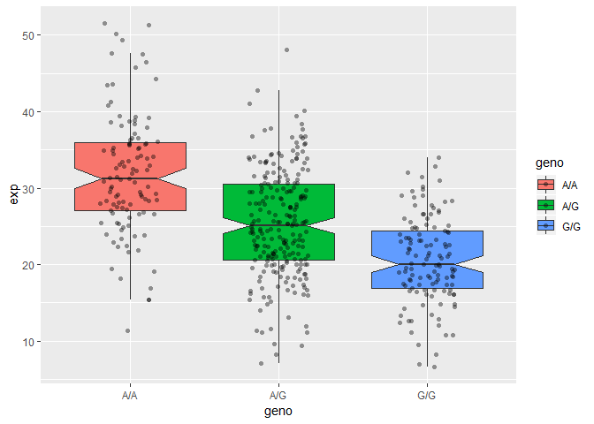

Class13
================

Variant Data
------------

``` r
mxl <- read.csv("Variant Data.csv", row.names = 1)
```

``` r
data.class(mxl)
```

    ## [1] "data.frame"

``` r
head(mxl)
```

    ##             Genotype..forward.strand. Population.s. Father Mother
    ## NA19648 (F)                       A|A ALL, AMR, MXL      -      -
    ## NA19649 (M)                       G|G ALL, AMR, MXL      -      -
    ## NA19651 (F)                       A|A ALL, AMR, MXL      -      -
    ## NA19652 (M)                       G|G ALL, AMR, MXL      -      -
    ## NA19654 (F)                       G|G ALL, AMR, MXL      -      -
    ## NA19655 (M)                       A|G ALL, AMR, MXL      -      -

``` r
mxl$Genotype..forward.strand.
```

    ##  [1] A|A G|G A|A G|G G|G A|G A|G A|A A|G A|A G|A A|A A|A G|G A|A A|G A|G
    ## [18] A|G A|G G|A A|G G|G G|G G|A G|G A|G A|A A|A A|G A|A A|G G|A G|G A|A
    ## [35] A|A A|A G|A A|G A|G A|G A|A G|A A|G G|A G|A A|A A|A A|G A|A A|A A|G
    ## [52] A|G A|A G|A A|A G|A A|G A|A G|A A|G G|G A|A G|A A|G
    ## Levels: A|A A|G G|A G|G

``` r
table(mxl)
```

    ## , , Father = -, Mother = -
    ## 
    ##                          Population.s.
    ## Genotype..forward.strand. ALL, AMR, MXL
    ##                       A|A            22
    ##                       A|G            21
    ##                       G|A            12
    ##                       G|G             9

``` r
table(mxl$Genotype..forward.strand.) / nrow(mxl) * 100
```

    ## 
    ##     A|A     A|G     G|A     G|G 
    ## 34.3750 32.8125 18.7500 14.0625

``` r
#install.packages("seqinr")
#install.packages("gtools")
library(seqinr)
```

    ## Warning: package 'seqinr' was built under R version 3.5.2

``` r
library(gtools)
```

    ## Warning: package 'gtools' was built under R version 3.5.2

``` r
chars <- s2c("DDDDCDEDCDDDDBBDDDCC@")
chars
```

    ##  [1] "D" "D" "D" "D" "C" "D" "E" "D" "C" "D" "D" "D" "D" "B" "B" "D" "D"
    ## [18] "D" "C" "C" "@"

``` r
phred <- asc(chars) - 33
phred
```

    ##  D  D  D  D  C  D  E  D  C  D  D  D  D  B  B  D  D  D  C  C  @ 
    ## 35 35 35 35 34 35 36 35 34 35 35 35 35 33 33 35 35 35 34 34 31

``` r
expr <- read.table("RNA_seq_final_file_section_4.txt")
head(expr)
```

    ##    sample geno      exp
    ## 1 HG00367  A/G 28.96038
    ## 2 NA20768  A/G 20.24449
    ## 3 HG00361  A/A 31.32628
    ## 4 HG00135  A/A 34.11169
    ## 5 NA18870  G/G 18.25141
    ## 6 NA11993  A/A 32.89721

``` r
table(expr$geno)
```

    ## 
    ## A/A A/G G/G 
    ## 108 233 121

``` r
inds.gg <- expr$geno == "G/G"
summary(expr[inds.gg, "exp"])
```

    ##    Min. 1st Qu.  Median    Mean 3rd Qu.    Max. 
    ##   6.675  16.903  20.074  20.594  24.457  33.956

``` r
inds.ag <- expr$geno == "A/G"
summary(expr[inds.ag, "exp"])
```

    ##    Min. 1st Qu.  Median    Mean 3rd Qu.    Max. 
    ##   7.075  20.626  25.065  25.397  30.552  48.034

``` r
inds.aa <- expr$geno == "A/A"
summary(expr[inds.aa, "exp"])
```

    ##    Min. 1st Qu.  Median    Mean 3rd Qu.    Max. 
    ##   11.40   27.02   31.25   31.82   35.92   51.52

``` r
boxplot(exp ~ geno, data = expr, notch=TRUE)
```


``` r
# Boxplot with the data shown
library(ggplot2)
```

    ## Warning: package 'ggplot2' was built under R version 3.5.2

``` r
ggplot(expr, aes(geno, exp, fill=geno)) + 
  geom_boxplot(notch=TRUE, outlier.shape = NA) + 
  geom_jitter(shape=16, position=position_jitter(0.2), alpha=0.4)
```


