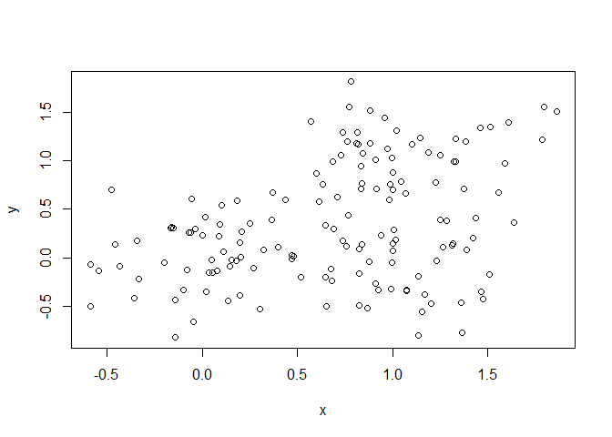

Class\_08
================
Joshua Chevez
February 6, 2019

Class 08
--------

``` r
tmp <- c(rnorm(30,-3), rnorm(30,3))
x <- cbind(x=tmp, y=rev(tmp))
plot(x)
```


``` r
km <- kmeans(x, 2, nstart=20)
km
```

    ## K-means clustering with 2 clusters of sizes 30, 30
    ## 
    ## Cluster means:
    ##           x         y
    ## 1  2.979988 -3.324600
    ## 2 -3.324600  2.979988
    ## 
    ## Clustering vector:
    ##  [1] 2 2 2 2 2 2 2 2 2 2 2 2 2 2 2 2 2 2 2 2 2 2 2 2 2 2 2 2 2 2 1 1 1 1 1
    ## [36] 1 1 1 1 1 1 1 1 1 1 1 1 1 1 1 1 1 1 1 1 1 1 1 1 1
    ## 
    ## Within cluster sum of squares by cluster:
    ## [1] 74.53829 74.53829
    ##  (between_SS / total_SS =  88.9 %)
    ## 
    ## Available components:
    ## 
    ## [1] "cluster"      "centers"      "totss"        "withinss"    
    ## [5] "tot.withinss" "betweenss"    "size"         "iter"        
    ## [9] "ifault"

Size of clusters

``` r
km$size
```

    ## [1] 30 30

``` r
km$cluster
```

    ##  [1] 2 2 2 2 2 2 2 2 2 2 2 2 2 2 2 2 2 2 2 2 2 2 2 2 2 2 2 2 2 2 1 1 1 1 1
    ## [36] 1 1 1 1 1 1 1 1 1 1 1 1 1 1 1 1 1 1 1 1 1 1 1 1 1

``` r
plot(x, col=km$cluster)
points(km$centers, col="blue", pch=15, cex=3)
```


Heirarchial Clustering
----------------------

``` r
# First we need to calculate point (dis)similarity
# as the Euclidean distance between observations
dist_matrix <- dist(x)
# The hclust() function returns a hierarchical
# clustering model
hc <- hclust(d = dist_matrix)
# the print method is not so useful here
hc 
```

    ## 
    ## Call:
    ## hclust(d = dist_matrix)
    ## 
    ## Cluster method   : complete 
    ## Distance         : euclidean 
    ## Number of objects: 60

``` r
plot(hc)
abline(h=6, col="red")
```


``` r
grp2 <- cutree(hc, h=6)
```

``` r
plot(x, col=grp2)
```


``` r
plot(hc)
abline(h=2.5, col="blue")
```


``` r
grp6 <- cutree(hc, h=2.5)
table(grp6)
```

    ## grp6
    ##  1  2  3  4  5  6  7  8  9 10 
    ##  2 13 10  4  1 10 13  4  2  1

We can also use k= groups as an argument to cutree

``` r
cutree(hc, k=2)
```

    ##  [1] 1 1 1 1 1 1 1 1 1 1 1 1 1 1 1 1 1 1 1 1 1 1 1 1 1 1 1 1 1 1 2 2 2 2 2
    ## [36] 2 2 2 2 2 2 2 2 2 2 2 2 2 2 2 2 2 2 2 2 2 2 2 2 2

``` r
d <- dist_matrix
```

``` r
# Using different hierarchical clustering methods
hc.complete <- hclust(d, method="complete")
plot(hc.complete)
```


``` r
hc.average <- hclust(d, method="average")
plot(hc.average)
```


``` r
hc.single <- hclust(d, method="single")
plot(hc.single)
```


``` r
# Step 1. Generate some example data for clustering
x <- rbind(
 matrix(rnorm(100, mean=0, sd = 0.3), ncol = 2), # c1
 matrix(rnorm(100, mean = 1, sd = 0.3), ncol = 2), # c2
 matrix(c(rnorm(50, mean = 1, sd = 0.3), # c3
 rnorm(50, mean = 0, sd = 0.3)), ncol = 2))
colnames(x) <- c("x", "y")
# Step 2. Plot the data without clustering
plot(x)
```



``` r
# Step 3. Generate colors for known clusters
# (just so we can compare to hclust results)
col <- as.factor( rep(c("c1","c2","c3"), each=50) )
plot(x, col=col)
```


``` r
d <- dist(x)
n <- hclust(d)
plot(n)
```


``` r
grps <- cutree(n, k=3)
plot(x, col=grps)
```


PCA in R
========

``` r
mydata <- read.csv("https://tinyurl.com/expression-CSV",
 row.names=1)
head(mydata)
```

    ##        wt1 wt2  wt3  wt4 wt5 ko1 ko2 ko3 ko4 ko5
    ## gene1  439 458  408  429 420  90  88  86  90  93
    ## gene2  219 200  204  210 187 427 423 434 433 426
    ## gene3 1006 989 1030 1017 973 252 237 238 226 210
    ## gene4  783 792  829  856 760 849 856 835 885 894
    ## gene5  181 249  204  244 225 277 305 272 270 279
    ## gene6  460 502  491  491 493 612 594 577 618 638

``` r
## lets do PCA
pca <- prcomp(t(mydata), scale=TRUE)
summary(pca)
```

    ## Importance of components:
    ##                           PC1    PC2     PC3     PC4     PC5     PC6
    ## Standard deviation     9.6237 1.5198 1.05787 1.05203 0.88062 0.82545
    ## Proportion of Variance 0.9262 0.0231 0.01119 0.01107 0.00775 0.00681
    ## Cumulative Proportion  0.9262 0.9493 0.96045 0.97152 0.97928 0.98609
    ##                            PC7     PC8     PC9      PC10
    ## Standard deviation     0.80111 0.62065 0.60342 3.348e-15
    ## Proportion of Variance 0.00642 0.00385 0.00364 0.000e+00
    ## Cumulative Proportion  0.99251 0.99636 1.00000 1.000e+00

Make our first PCA plot

``` r
dim(pca$x)
```

    ## [1] 10 10

``` r
plot(pca$x[,1], pca$x[,2])
```


``` r
## lets do PCA
pca <- prcomp(t(mydata), scale=TRUE)
## A basic PC1 vs PC2 2-D plot
plot(pca$x[,1], pca$x[,2])
```


``` r
## Precent variance is often more informative to look at
pca.var <- pca$sdev^2
pca.var.per <- round(pca.var/sum(pca.var)*100, 1)

pca.var.per
```

    ##  [1] 92.6  2.3  1.1  1.1  0.8  0.7  0.6  0.4  0.4  0.0

``` r
pca.var <- pca$sdev^2
pca.var.per <- round(pca.var/sum(pca.var)*100, 1)

barplot(pca.var.per, main="Scree Plot",
 xlab="Principal Component", ylab="Percent Variation")
```


``` r
## A vector of colors for wt and ko samples
colvec <- as.factor( substr( colnames(mydata), 1, 2) )
plot(pca$x[,1], pca$x[,2], col=colvec, pch=16,
 xlab=paste0("PC1 (", pca.var.per[1], "%)"),
 ylab=paste0("PC2 (", pca.var.per[2], "%)")) 
```


``` r
x = read.csv("UK_foods.csv")
ncol(x)
```

    ## [1] 5

``` r
nrow(x)
```

    ## [1] 17

``` r
View(x)
rownames(x) <- x[,1]
```

Simper way of changing the first column to be the row names

``` r
x = read.csv("UK_foods.csv", row.names = 1)
View(x)
```

``` r
barplot(as.matrix(x), beside=T, col=rainbow(nrow(x)))
```


``` r
pairs(x, col=rainbow(10), pch=16)
```


PCA
===

``` r
# Use the prcomp() PCA function 
pca <- prcomp( t(x) )
summary(pca)
```

    ## Importance of components:
    ##                             PC1      PC2      PC3       PC4
    ## Standard deviation     324.1502 212.7478 73.87622 4.189e-14
    ## Proportion of Variance   0.6744   0.2905  0.03503 0.000e+00
    ## Cumulative Proportion    0.6744   0.9650  1.00000 1.000e+00

Make PCA plot

``` r
plot(pca$x[,1], pca$x[,2])
text(pca$x[,1], pca$x[,2], labels = colnames(x), col=c("orange", "red", "blue", "darkgreen"))
```


``` r
## Lets focus on PC1 as it accounts for > 90% of variance 
par(mar=c(10, 3, 0.35, 0))
barplot( pca$rotation[,1], las=2 )
```


