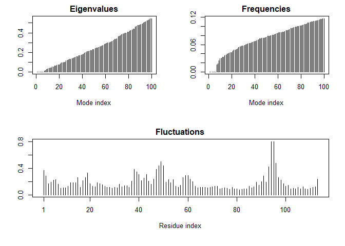

Class\_11
================

Class 11
--------

``` r
stats <- read.csv("Data Export Summary.csv", row.names = 1)
stats
```

    ##                     Proteins Nucleic.Acids Protein.NA.Complex Other  Total
    ## X-Ray                 124770          1993               6451    10 133224
    ## NMR                    10988          1273                257     8  12526
    ## Electron Microscopy     2057            31                723     0   2811
    ## Other                    250             4                  6    13    273
    ## Multi Method             127             5                  2     1    135

Q1

``` r
pre.by.method <- stats$Total/sum(stats$Total) * 100
names(pre.by.method) <- row.names(stats)
pre.by.method
```

    ##               X-Ray                 NMR Electron Microscopy 
    ##         89.43068692          8.40846082          1.88696977 
    ##               Other        Multi Method 
    ##          0.18325960          0.09062288

Q2 What proportion of structures are protein

``` r
total <- sum(stats$Total)
total.p <- sum(stats$Proteins)
total.p/total
```

    ## [1] 0.9276561

Datapasta

``` r
tmp <- data.frame(stringsAsFactors=FALSE,
   Experimental.Method = c("X-Ray", "NMR", "Electron Microscopy", "Other",
                           "Multi Method", "Total"),
              Proteins = c(124770, 10988, 2057, 250, 127, 138192),
         Nucleic.Acids = c(1993, 1273, 31, 4, 5, 3306),
    ProteinNA.Complex = c(6451, 257, 723, 6, 2, 7439),
                 Other = c(10, 8, 0, 13, 1, 32),
                 Total = c(133224, 12526, 2811, 273, 135, 148969)
)
```

Bio3D
-----

``` r
library(bio3d)
```

    ## Warning: package 'bio3d' was built under R version 3.5.2

``` r
pdb <- read.pdb("1hsg")
```

    ##   Note: Accessing on-line PDB file

``` r
pdb
```

    ## 
    ##  Call:  read.pdb(file = "1hsg")
    ## 
    ##    Total Models#: 1
    ##      Total Atoms#: 1686,  XYZs#: 5058  Chains#: 2  (values: A B)
    ## 
    ##      Protein Atoms#: 1514  (residues/Calpha atoms#: 198)
    ##      Nucleic acid Atoms#: 0  (residues/phosphate atoms#: 0)
    ## 
    ##      Non-protein/nucleic Atoms#: 172  (residues: 128)
    ##      Non-protein/nucleic resid values: [ HOH (127), MK1 (1) ]
    ## 
    ##    Protein sequence:
    ##       PQITLWQRPLVTIKIGGQLKEALLDTGADDTVLEEMSLPGRWKPKMIGGIGGFIKVRQYD
    ##       QILIEICGHKAIGTVLVGPTPVNIIGRNLLTQIGCTLNFPQITLWQRPLVTIKIGGQLKE
    ##       ALLDTGADDTVLEEMSLPGRWKPKMIGGIGGFIKVRQYDQILIEICGHKAIGTVLVGPTP
    ##       VNIIGRNLLTQIGCTLNF
    ## 
    ## + attr: atom, xyz, seqres, helix, sheet,
    ##         calpha, remark, call

Does not work on pc
-------------------

``` r
# The 'devtools' package allows us to install development versions
#install.packages("devtools")
# Install the bio3d.view package from bitbucket
devtools::install_bitbucket("Grantlab/bio3d-view")
```

    ## Downloading bitbucket repo Grantlab/bio3d-view@master

    ## WARNING: Rtools is required to build R packages, but is not currently installed.
    ## 
    ## Please download and install Rtools 3.5 from http://cran.r-project.org/bin/windows/Rtools/.

    ##   
      
      
       checking for file 'C:\Users\josha\AppData\Local\Temp\RtmpUXTZDj\remotes5998127604\Grantlab-bio3d-view-dd1539876fa8/DESCRIPTION' ...
      
       checking for file 'C:\Users\josha\AppData\Local\Temp\RtmpUXTZDj\remotes5998127604\Grantlab-bio3d-view-dd1539876fa8/DESCRIPTION' ... 
      
    v  checking for file 'C:\Users\josha\AppData\Local\Temp\RtmpUXTZDj\remotes5998127604\Grantlab-bio3d-view-dd1539876fa8/DESCRIPTION' (579ms)
    ## 
      
      
      
    -  preparing 'bio3d.view':
    ## 
      
       checking DESCRIPTION meta-information ...
      
       checking DESCRIPTION meta-information ... 
      
    v  checking DESCRIPTION meta-information
    ## 
      
      
      
    -  checking for LF line-endings in source and make files and shell scripts
    ## 
      
      
      
    -  checking for empty or unneeded directories
    ## 
      
      
      
    -  building 'bio3d.view_0.1.0.9000.tar.gz'
    ## 
      
       
    ## 

    ## Installing package into 'C:/Users/josha/Documents/R/win-library/3.5'
    ## (as 'lib' is unspecified)

``` r
library("bio3d.view")
#(pdb, "overview", col = "sse")
```

Extract the protein only portion of this PDB structure and write it out to a new PDB file.
==========================================================================================

Extract the ligand (i.e. drug)

``` r
ca.inds <- atom.select(pdb, "calpha")
ca.inds
```

    ## 
    ##  Call:  atom.select.pdb(pdb = pdb, string = "calpha")
    ## 
    ##    Atom Indices#: 198  ($atom)
    ##    XYZ  Indices#: 594  ($xyz)
    ## 
    ## + attr: atom, xyz, call

``` r
# Print details of the first few selected atoms
head( pdb$atom[ca.inds$atom, ] )
```

    ##    type eleno elety  alt resid chain resno insert      x      y     z o
    ## 2  ATOM     2    CA <NA>   PRO     A     1   <NA> 30.307 38.663 5.319 1
    ## 9  ATOM     9    CA <NA>   GLN     A     2   <NA> 30.158 36.492 2.199 1
    ## 18 ATOM    18    CA <NA>   ILE     A     3   <NA> 29.123 33.098 3.397 1
    ## 26 ATOM    26    CA <NA>   THR     A     4   <NA> 29.774 30.143 1.062 1
    ## 33 ATOM    33    CA <NA>   LEU     A     5   <NA> 27.644 27.003 1.144 1
    ## 41 ATOM    41    CA <NA>   TRP     A     6   <NA> 30.177 24.150 1.279 1
    ##        b segid elesy charge
    ## 2  40.62  <NA>     C   <NA>
    ## 9  41.30  <NA>     C   <NA>
    ## 18 34.13  <NA>     C   <NA>
    ## 26 30.14  <NA>     C   <NA>
    ## 33 30.12  <NA>     C   <NA>
    ## 41 30.82  <NA>     C   <NA>

``` r
write.pdb(pdb, "pdb_protein only")
```

``` r
inds <- atom.select(pdb, "ligand")
inds
```

    ## 
    ##  Call:  atom.select.pdb(pdb = pdb, string = "ligand")
    ## 
    ##    Atom Indices#: 45  ($atom)
    ##    XYZ  Indices#: 135  ($xyz)
    ## 
    ## + attr: atom, xyz, call

``` r
inds$atom
```

    ##  [1] 1515 1516 1517 1518 1519 1520 1521 1522 1523 1524 1525 1526 1527 1528
    ## [15] 1529 1530 1531 1532 1533 1534 1535 1536 1537 1538 1539 1540 1541 1542
    ## [29] 1543 1544 1545 1546 1547 1548 1549 1550 1551 1552 1553 1554 1555 1556
    ## [43] 1557 1558 1559

``` r
pdb$atom[inds$atom, 1:5]
```

    ##        type eleno elety  alt resid
    ## 1515 HETATM  1517    N1 <NA>   MK1
    ## 1516 HETATM  1518    C1 <NA>   MK1
    ## 1517 HETATM  1519    C2 <NA>   MK1
    ## 1518 HETATM  1520    C3 <NA>   MK1
    ## 1519 HETATM  1521    O1 <NA>   MK1
    ## 1520 HETATM  1522    N2 <NA>   MK1
    ## 1521 HETATM  1523    C4 <NA>   MK1
    ## 1522 HETATM  1524    C5 <NA>   MK1
    ## 1523 HETATM  1525    C6 <NA>   MK1
    ## 1524 HETATM  1526    C7 <NA>   MK1
    ## 1525 HETATM  1527    N3 <NA>   MK1
    ## 1526 HETATM  1528    C8 <NA>   MK1
    ## 1527 HETATM  1529    C9 <NA>   MK1
    ## 1528 HETATM  1530   C10 <NA>   MK1
    ## 1529 HETATM  1531   C11 <NA>   MK1
    ## 1530 HETATM  1532    O2 <NA>   MK1
    ## 1531 HETATM  1533   C12 <NA>   MK1
    ## 1532 HETATM  1534   C13 <NA>   MK1
    ## 1533 HETATM  1535   C14 <NA>   MK1
    ## 1534 HETATM  1536   C15 <NA>   MK1
    ## 1535 HETATM  1537   C16 <NA>   MK1
    ## 1536 HETATM  1538   C17 <NA>   MK1
    ## 1537 HETATM  1539   C18 <NA>   MK1
    ## 1538 HETATM  1540   C19 <NA>   MK1
    ## 1539 HETATM  1541   C20 <NA>   MK1
    ## 1540 HETATM  1542   C21 <NA>   MK1
    ## 1541 HETATM  1543    O3 <NA>   MK1
    ## 1542 HETATM  1544    N4 <NA>   MK1
    ## 1543 HETATM  1545   C22 <NA>   MK1
    ## 1544 HETATM  1546   C23 <NA>   MK1
    ## 1545 HETATM  1547    O4 <NA>   MK1
    ## 1546 HETATM  1548   C24 <NA>   MK1
    ## 1547 HETATM  1549   C25 <NA>   MK1
    ## 1548 HETATM  1550   C26 <NA>   MK1
    ## 1549 HETATM  1551   C27 <NA>   MK1
    ## 1550 HETATM  1552   C28 <NA>   MK1
    ## 1551 HETATM  1553   C29 <NA>   MK1
    ## 1552 HETATM  1554   C30 <NA>   MK1
    ## 1553 HETATM  1555   C31 <NA>   MK1
    ## 1554 HETATM  1556   C32 <NA>   MK1
    ## 1555 HETATM  1557   C33 <NA>   MK1
    ## 1556 HETATM  1558    N5 <NA>   MK1
    ## 1557 HETATM  1559   C34 <NA>   MK1
    ## 1558 HETATM  1560   C35 <NA>   MK1
    ## 1559 HETATM  1561   C36 <NA>   MK1

``` r
ligand.pdb <- trim.pdb(pdb, inds)
ligand.pdb
```

    ## 
    ##  Call:  trim.pdb(pdb = pdb, inds)
    ## 
    ##    Total Models#: 1
    ##      Total Atoms#: 45,  XYZs#: 135  Chains#: 1  (values: B)
    ## 
    ##      Protein Atoms#: 0  (residues/Calpha atoms#: 0)
    ##      Nucleic acid Atoms#: 0  (residues/phosphate atoms#: 0)
    ## 
    ##      Non-protein/nucleic Atoms#: 45  (residues: 1)
    ##      Non-protein/nucleic resid values: [ MK1 (1) ]
    ## 
    ## + attr: atom, helix, sheet, seqres, xyz,
    ##         calpha, call

``` r
write.pdb(ligand.pdb, file = "ligand.pdb")
```

normal mode analysis
====================

``` r
pdb.1 <- read.pdb("1YAT")
```

    ##   Note: Accessing on-line PDB file

``` r
#Normal Mode Analysis
modes <- nma(pdb.1)
```

    ##  Building Hessian...     Done in 0 seconds.
    ##  Diagonalizing Hessian...    Done in 0.08 seconds.

``` r
plot(modes)
```



``` r
m7 <- mktrj(modes,
 mode=7,
 file="mode_7.pdb")
```
