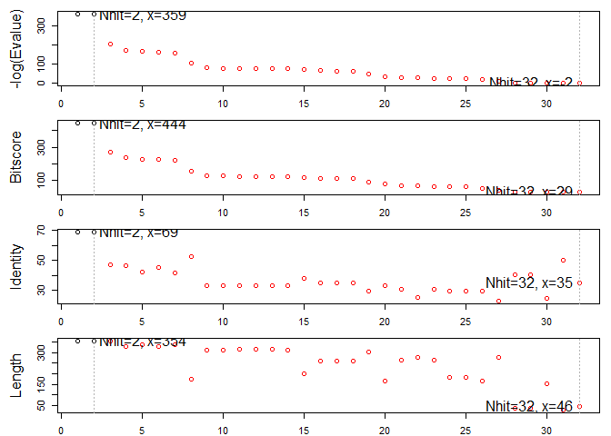

Find a gene project
================

``` r
library(bio3d)
```

    ## Warning: package 'bio3d' was built under R version 3.5.2

Q7
==

``` r
almt <- read.fasta("MEGA Alignment FASTA Format.fas")
```

``` r
sim <- seqidentity(almt)
```

``` r
heatmap(sim, margins = c(11, 4))
```


Q8
==

``` r
cs <- consensus(almt)
cs_seq <- cs$seq
cs_seq
```

    ##   [1] "M" "T" "L" "E" "A" "I" "R" "Y" "R" "-" "G" "-" "-" "-" "-" "-" "S"
    ##  [18] "L" "Q" "I" "L" "N" "Q" "L" "L" "L" "P" "H" "Q" "T" "V" "Y" "-" "-"
    ##  [35] "I" "R" "S" "V" "Q" "D" "A" "Y" "E" "A" "I" "K" "S" "M" "K" "V" "R"
    ##  [52] "G" "A" "P" "A" "I" "A" "I" "V" "G" "C" "L" "S" "L" "A" "V" "E" "L"
    ##  [69] "R" "-" "-" "-" "-" "-" "-" "-" "-" "-" "-" "-" "-" "-" "-" "A" "G"
    ##  [86] "A" "G" "G" "D" "D" "P" "V" "T" "F" "I" "R" "E" "S" "L" "C" "H" "L"
    ## [103] "T" "S" "A" "R" "P" "T" "A" "V" "N" "M" "G" "R" "A" "A" "R" "E" "L"
    ## [120] "M" "E" "F" "A" "E" "N" "E" "S" "M" "E" "K" "N" "S" "E" "Q" "L" "R"
    ## [137] "E" "S" "V" "I" "-" "W" "I" "E" "-" "M" "L" "E" "R" "D" "V" "N" "D"
    ## [154] "N" "-" "K" "I" "G" "N" "Y" "G" "A" "Q" "H" "I" "L" "S" "G" "V" "P"
    ## [171] "R" "D" "S" "-" "-" "-" "-" "V" "T" "I" "L" "T" "H" "C" "N" "T" "G"
    ## [188] "S" "L" "A" "T" "A" "G" "Y" "G" "T" "A" "L" "G" "V" "V" "R" "S" "L"
    ## [205] "-" "-" "-" "-" "-" "-" "-" "-" "-" "-" "-" "-" "-" "-" "-" "-" "-"
    ## [222] "H" "A" "L" "G" "R" "L" "K" "R" "V" "Y" "C" "T" "E" "T" "R" "P" "Y"
    ## [239] "N" "Q" "G" "S" "R" "L" "T" "A" "Y" "E" "A" "V" "A" "E" "G" "I" "P"
    ## [256] "A" "T" "L" "I" "T" "D" "S" "M" "A" "A" "L" "T" "M" "R" "E" "-" "-"
    ## [273] "M" "-" "I" "T" "A" "V" "V" "V" "G" "A" "D" "R" "V" "V" "A" "N" "G"
    ## [290] "D" "T" "A" "N" "K" "V" "G" "T" "Y" "Q" "L" "A" "I" "A" "A" "K" "H"
    ## [307] "H" "G" "I" "P" "F" "Y" "V" "A" "A" "P" "S" "T" "S" "C" "D" "L" "S"
    ## [324] "L" "E" "S" "G" "R" "D" "I" "-" "I" "E" "V" "R" "P" "P" "E" "E" "L"
    ## [341] "T" "S" "I" "N" "G" "-" "-" "-" "-" "-" "-" "-" "-" "-" "-" "-" "-"
    ## [358] "-" "-" "-" "-" "-" "-" "-" "-" "-" "-" "V" "P" "I" "A" "A" "P" "G"
    ## [375] "I" "E" "V" "W" "N" "P" "A" "F" "D" "V" "T" "P" "H" "Q" "L" "I" "T"
    ## [392] "G" "G" "I" "I" "T" "E" "L" "G" "V" "F" "L" "P" "S" "E" "L" "Q" "A"
    ## [409] "A" "L" "T" "G" "R" "L" "T" "A" "L"

``` r
bhts <- blast.pdb(cs_seq)
```

    ##  Searching ... please wait (updates every 5 seconds) RID = 7PGYNM27014 
    ##  .
    ##  Reporting 32 hits

``` r
bhts
```

    ## $hit.tbl
    ##        queryid subjectids identity alignmentlength mismatches gapopens
    ## 1  Query_45195     4LDQ_A   68.644             354         96        9
    ## 2  Query_45195     4LDR_A   68.644             354         96        9
    ## 3  Query_45195     2A0U_A   47.175             354        162       11
    ## 4  Query_45195     1T9K_A   46.505             329        157       10
    ## 5  Query_45195     1T5O_A   42.183             339        178       10
    ## 6  Query_45195     2YRF_A   45.427             328        161        9
    ## 7  Query_45195     6A34_A   41.667             336        177       11
    ## 8  Query_45195     1W2W_B   52.273             176         57        4
    ## 9  Query_45195     3A11_A   33.121             314        183       10
    ## 10 Query_45195     3VM6_A   32.803             314        184       10
    ## 11 Query_45195     3A9C_A   33.016             315        183       11
    ## 12 Query_45195     3A9C_D   33.016             315        183       11
    ## 13 Query_45195     3A9C_C   33.016             315        183       11
    ## 14 Query_45195     3A9C_B   33.121             314        181       11
    ## 15 Query_45195     1W2W_A   37.811             201         97        6
    ## 16 Query_45195     5YFJ_A   35.135             259        143        9
    ## 17 Query_45195     5YFT_A   34.749             259        144        9
    ## 18 Query_45195     5YFS_A   34.749             259        144        9
    ## 19 Query_45195     1VB5_A   29.373             303        162       12
    ## 20 Query_45195     5B04_A   33.333             168         85        7
    ## 21 Query_45195     6EZO_A   30.451             266        152       13
    ## 22 Query_45195     6EZO_G   25.362             276        173        9
    ## 23 Query_45195     3ECS_A   30.451             266        152       13
    ## 24 Query_45195     6CAJ_C   29.348             184        122        6
    ## 25 Query_45195     6EZO_C   29.348             184        122        6
    ## 26 Query_45195     5B04_C   29.697             165        101        6
    ## 27 Query_45195     5B04_G   22.744             277        183       12
    ## 28 Query_45195     4K7X_A   40.541              37         21        1
    ## 29 Query_45195     4Q60_A   40.541              37         21        1
    ## 30 Query_45195     5YKH_A   24.503             151         95        5
    ## 31 Query_45195     4J9W_A   50.000              28         13        1
    ## 32 Query_45195     3R8X_A   34.783              46         27        1
    ##    q.start q.end s.start s.end    evalue bitscore positives mlog.evalue
    ## 1        1   339       1   354 4.52e-157    445.0     80.23 359.9973476
    ## 2        1   339       1   354 1.38e-156    444.0     79.94 358.8811910
    ## 3        2   332      17   368  3.59e-88    270.0     64.12 201.3493360
    ## 4       11   331      16   333  3.46e-75    236.0     59.27 171.4526134
    ## 5        1   331       1   329  3.40e-72    228.0     59.59 164.5623513
    ## 6       11   329      38   356  3.19e-71    226.0     58.23 162.3235207
    ## 7        6   331      17   343  2.32e-68    219.0     60.12 155.7342191
    ## 8      180   329       3   177  4.67e-46    155.0     59.66 104.3777552
    ## 9       27   331      20   315  1.17e-34    130.0     50.64  78.1308894
    ## 10      27   331      20   315  4.06e-33    126.0     50.32  74.5841251
    ## 11      27   331       2   298  4.25e-33    125.0     50.48  74.5383891
    ## 12      27   331       4   300  5.38e-33    125.0     50.48  74.3026197
    ## 13      27   331       3   299  5.50e-33    125.0     50.48  74.2805600
    ## 14      27   331      10   303  1.82e-32    124.0     50.32  73.0838865
    ## 15       2   175       2   201  2.93e-30    115.0     57.21  68.0025504
    ## 16      80   331      61   301  1.18e-28    114.0     51.35  64.3068682
    ## 17      80   331      61   301  6.72e-28    111.0     51.35  62.5672944
    ## 18      80   331      61   301  3.12e-27    110.0     50.97  61.0319645
    ## 19      37   331      13   271  2.86e-20     89.7     45.87  45.0008802
    ## 20     183   328     163   325  3.02e-15     76.6     47.62  33.4335196
    ## 21      75   332      54   294  2.93e-12     67.4     45.49  26.5560187
    ## 22      68   329     251   507  1.14e-11     66.6     44.57  25.1974078
    ## 23      75   332      54   294  9.04e-11     62.8     45.11  23.1267768
    ## 24     152   332     173   351  3.41e-10     61.6     42.93  21.7991386
    ## 25     152   332     178   356  3.70e-10     61.6     42.93  21.7175181
    ## 26     177   334     228   384  1.17e-07     53.9     43.03  15.9610919
    ## 27      71   332     192   452  1.00e-03     41.2     44.04   6.9077553
    ## 28     145   181      93   128  1.30e+00     31.6     64.86  -0.2623643
    ## 29     145   181      92   127  1.30e+00     31.6     64.86  -0.2623643
    ## 30      92   239     132   266  1.60e+00     31.6     39.74  -0.4700036
    ## 31     156   183     103   129  5.00e+00     30.0     75.00  -1.6094379
    ## 32     218   263      25    67  8.70e+00     29.3     47.83  -2.1633230
    ##    pdb.id    acc
    ## 1  4LDQ_A 4LDQ_A
    ## 2  4LDR_A 4LDR_A
    ## 3  2A0U_A 2A0U_A
    ## 4  1T9K_A 1T9K_A
    ## 5  1T5O_A 1T5O_A
    ## 6  2YRF_A 2YRF_A
    ## 7  6A34_A 6A34_A
    ## 8  1W2W_B 1W2W_B
    ## 9  3A11_A 3A11_A
    ## 10 3VM6_A 3VM6_A
    ## 11 3A9C_A 3A9C_A
    ## 12 3A9C_D 3A9C_D
    ## 13 3A9C_C 3A9C_C
    ## 14 3A9C_B 3A9C_B
    ## 15 1W2W_A 1W2W_A
    ## 16 5YFJ_A 5YFJ_A
    ## 17 5YFT_A 5YFT_A
    ## 18 5YFS_A 5YFS_A
    ## 19 1VB5_A 1VB5_A
    ## 20 5B04_A 5B04_A
    ## 21 6EZO_A 6EZO_A
    ## 22 6EZO_G 6EZO_G
    ## 23 3ECS_A 3ECS_A
    ## 24 6CAJ_C 6CAJ_C
    ## 25 6EZO_C 6EZO_C
    ## 26 5B04_C 5B04_C
    ## 27 5B04_G 5B04_G
    ## 28 4K7X_A 4K7X_A
    ## 29 4Q60_A 4Q60_A
    ## 30 5YKH_A 5YKH_A
    ## 31 4J9W_A 4J9W_A
    ## 32 3R8X_A 3R8X_A
    ## 
    ## $raw
    ##        queryid subjectids identity alignmentlength mismatches gapopens
    ## 1  Query_45195     4LDQ_A   68.644             354         96        9
    ## 2  Query_45195     4LDR_A   68.644             354         96        9
    ## 3  Query_45195     2A0U_A   47.175             354        162       11
    ## 4  Query_45195     1T9K_A   46.505             329        157       10
    ## 5  Query_45195     1T5O_A   42.183             339        178       10
    ## 6  Query_45195     2YRF_A   45.427             328        161        9
    ## 7  Query_45195     6A34_A   41.667             336        177       11
    ## 8  Query_45195     1W2W_B   52.273             176         57        4
    ## 9  Query_45195     3A11_A   33.121             314        183       10
    ## 10 Query_45195     3VM6_A   32.803             314        184       10
    ## 11 Query_45195     3A9C_A   33.016             315        183       11
    ## 12 Query_45195     3A9C_D   33.016             315        183       11
    ## 13 Query_45195     3A9C_C   33.016             315        183       11
    ## 14 Query_45195     3A9C_B   33.121             314        181       11
    ## 15 Query_45195     1W2W_A   37.811             201         97        6
    ## 16 Query_45195     5YFJ_A   35.135             259        143        9
    ## 17 Query_45195     5YFT_A   34.749             259        144        9
    ## 18 Query_45195     5YFS_A   34.749             259        144        9
    ## 19 Query_45195     1VB5_A   29.373             303        162       12
    ## 20 Query_45195     5B04_A   33.333             168         85        7
    ## 21 Query_45195     6EZO_A   30.451             266        152       13
    ## 22 Query_45195     6EZO_G   25.362             276        173        9
    ## 23 Query_45195     3ECS_A   30.451             266        152       13
    ## 24 Query_45195     6CAJ_C   29.348             184        122        6
    ## 25 Query_45195     6EZO_C   29.348             184        122        6
    ## 26 Query_45195     5B04_C   29.697             165        101        6
    ## 27 Query_45195     5B04_G   22.744             277        183       12
    ## 28 Query_45195     4K7X_A   40.541              37         21        1
    ## 29 Query_45195     4Q60_A   40.541              37         21        1
    ## 30 Query_45195     5YKH_A   24.503             151         95        5
    ## 31 Query_45195     4J9W_A   50.000              28         13        1
    ## 32 Query_45195     3R8X_A   34.783              46         27        1
    ##    q.start q.end s.start s.end    evalue bitscore positives
    ## 1        1   339       1   354 4.52e-157    445.0     80.23
    ## 2        1   339       1   354 1.38e-156    444.0     79.94
    ## 3        2   332      17   368  3.59e-88    270.0     64.12
    ## 4       11   331      16   333  3.46e-75    236.0     59.27
    ## 5        1   331       1   329  3.40e-72    228.0     59.59
    ## 6       11   329      38   356  3.19e-71    226.0     58.23
    ## 7        6   331      17   343  2.32e-68    219.0     60.12
    ## 8      180   329       3   177  4.67e-46    155.0     59.66
    ## 9       27   331      20   315  1.17e-34    130.0     50.64
    ## 10      27   331      20   315  4.06e-33    126.0     50.32
    ## 11      27   331       2   298  4.25e-33    125.0     50.48
    ## 12      27   331       4   300  5.38e-33    125.0     50.48
    ## 13      27   331       3   299  5.50e-33    125.0     50.48
    ## 14      27   331      10   303  1.82e-32    124.0     50.32
    ## 15       2   175       2   201  2.93e-30    115.0     57.21
    ## 16      80   331      61   301  1.18e-28    114.0     51.35
    ## 17      80   331      61   301  6.72e-28    111.0     51.35
    ## 18      80   331      61   301  3.12e-27    110.0     50.97
    ## 19      37   331      13   271  2.86e-20     89.7     45.87
    ## 20     183   328     163   325  3.02e-15     76.6     47.62
    ## 21      75   332      54   294  2.93e-12     67.4     45.49
    ## 22      68   329     251   507  1.14e-11     66.6     44.57
    ## 23      75   332      54   294  9.04e-11     62.8     45.11
    ## 24     152   332     173   351  3.41e-10     61.6     42.93
    ## 25     152   332     178   356  3.70e-10     61.6     42.93
    ## 26     177   334     228   384  1.17e-07     53.9     43.03
    ## 27      71   332     192   452  1.00e-03     41.2     44.04
    ## 28     145   181      93   128  1.30e+00     31.6     64.86
    ## 29     145   181      92   127  1.30e+00     31.6     64.86
    ## 30      92   239     132   266  1.60e+00     31.6     39.74
    ## 31     156   183     103   129  5.00e+00     30.0     75.00
    ## 32     218   263      25    67  8.70e+00     29.3     47.83
    ## 
    ## $url
    ##                                                                                                                                                        7PGYNM27014 
    ## "https://blast.ncbi.nlm.nih.gov/Blast.cgi?CMD=Get&FORMAT_OBJECT=Alignment&ALIGNMENT_VIEW=Tabular&RESULTS_FILE=on&FORMAT_TYPE=CSV&ALIGNMENTS=20000&RID=7PGYNM27014" 
    ## 
    ## attr(,"class")
    ## [1] "blast"

``` r
plot.blast(bhts)
```

    ##   * Possible cutoff values:    358 -3 
    ##             Yielding Nhits:    2 32 
    ## 
    ##   * Chosen cutoff value of:    358 
    ##             Yielding Nhits:    2



``` r
top3 <- pdb.annotate(c("4LDQ_A", "2A0U_A", "1T9K_A"), anno.terms = c("structureId", "experimentalTechnique", "resolution", "source"))
```

    ## Warning in pdb.annotate(c("4LDQ_A", "2A0U_A", "1T9K_A"), anno.terms =
    ## c("structureId", : ids should be standard 4 character PDB-IDs: trying first
    ## 4 characters...

``` r
top3
```

    ##        structureId experimentalTechnique resolution              source
    ## 4LDQ_A        4LDQ     X-RAY DIFFRACTION        2.5        Homo sapiens
    ## 2A0U_A        2A0U     X-RAY DIFFRACTION        2.1    Leishmania major
    ## 1T9K_A        1T9K     X-RAY DIFFRACTION        2.6 Thermotoga maritima
