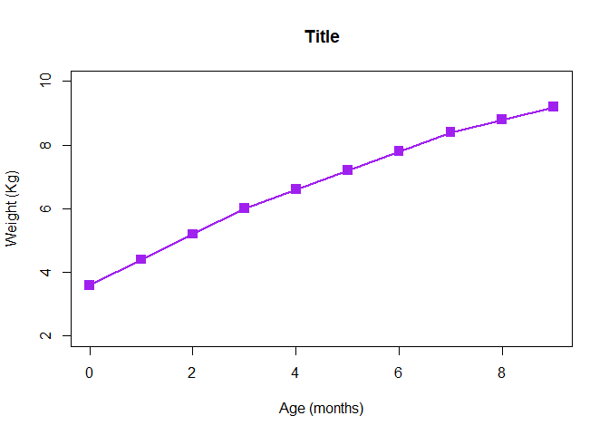
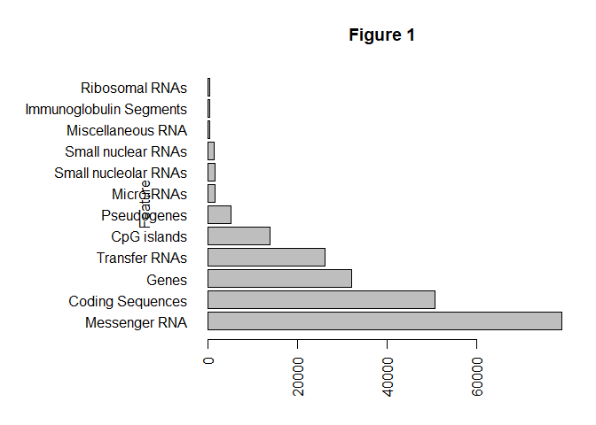
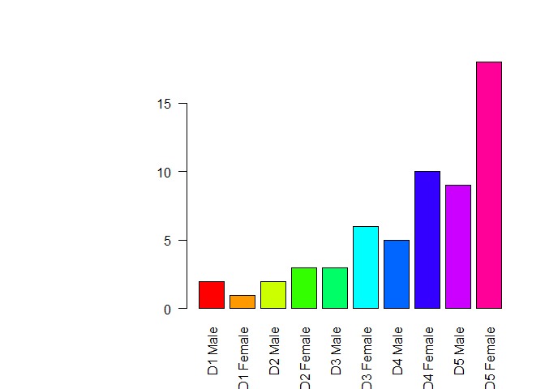
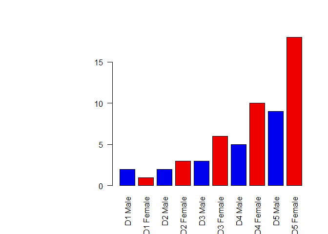
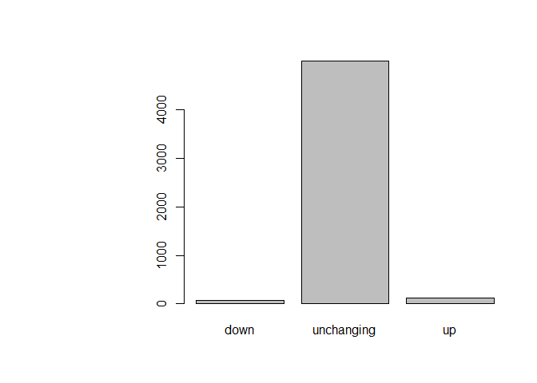
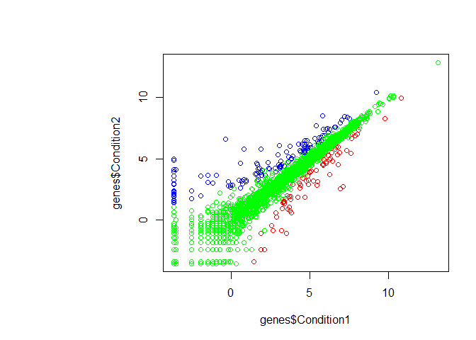

Class 05 Graphics and plots with R
================
Joshua Chevez
January 25th, 2019

``` r
#Class 05 Graphics and plots with R
#This is some narative text that I can style **bold** and *italic* and add links to [webpages](https://rmarkdown.rstudio.com/articles_report_from_r_script.html)

#Section 2A: line plot

weight <- read.table("bimm143_05_rstats/bimm143_05_rstats/weight_chart.txt", header = TRUE)

plot(weight, pch=15, cex=1.5, lwd=2, ylim=c(2, 10), xlab="Age (months)", ylab="Weight (Kg)", main="Title", type="o", col="purple")
```



``` r
#Section 2B
feat <- read.table("bimm143_05_rstats/bimm143_05_rstats/feature_counts.txt", header = TRUE, sep="\t")
barplot(feat$Count, names.arg = feat$Feature, las=2, horiz = TRUE, ylab="Feature", main = "Figure 1")

par(mar=c(5, 12, 4, 2))
barplot(feat$Count, names.arg = feat$Feature, las=2, horiz = TRUE, ylab="Feature", main = "Figure 1")
```



``` r
#Section 3A

mf <- read.table("bimm143_05_rstats/bimm143_05_rstats/male_female_counts.txt", header = TRUE, sep = "\t")
barplot(mf$Count, names.arg = mf$Sample, col=rainbow(c(nrow(mf))), las=2)
```



``` r
mfc <- read.delim("bimm143_05_rstats/bimm143_05_rstats/male_female_counts.txt")

mf <- read.table("bimm143_05_rstats/bimm143_05_rstats/male_female_counts.txt", header = TRUE, sep = "\t")
barplot(mf$Count, names.arg = mf$Sample, col=c("blue2", "red2"), las=2)
```



``` r
#Section 3B

genes <- read.table("bimm143_05_rstats/bimm143_05_rstats/up_down_expression.txt", header = TRUE)
plot(genes$State)
```



``` r
#Number of rows
nrow(genes)
```

    ## [1] 5196

``` r
table(genes$State)
```

    ## 
    ##       down unchanging         up 
    ##         72       4997        127

``` r
palette(c("red", "green", "blue"))
plot(genes$Condition1, genes$Condition2, col=genes$State)
```



``` r
palette()
```

    ## [1] "red"   "green" "blue"

``` r
levels(genes$State)
```

    ## [1] "down"       "unchanging" "up"
